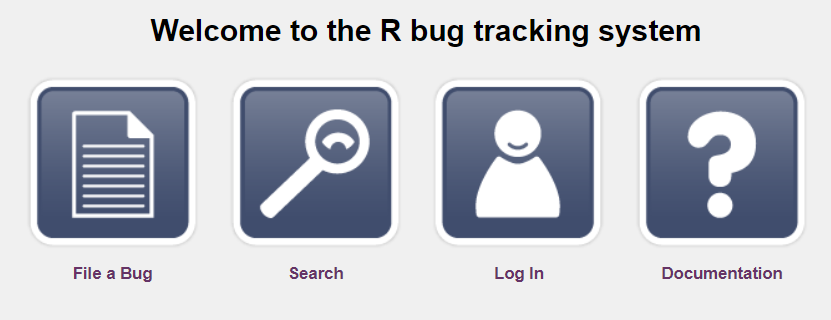

# Introduction

This guide is heavily influenced by the [Python Developer Guide](https://devguide.python.org/), and is a comprehensive resource for contributing to base R – for both new and experienced contributors. It is maintained by the [R Contribution Working Group](/working-group). We welcome your contributions to base R!

## Introduction to Bugzilla

Base R uses [Bugzilla](https://bugs.r-project.org/) for keeping track of bugs in R. To be able use R\'s Bugzilla for reporting or fixing bugs in R, you will first need an [account](#RCorePkgBug) on Bugzilla. Once you have set up your account and manage to log in to Bugzilla, you are good to go.

An image of the existing home page of Bugzilla is shared below:

On the home page of Bugzilla, there are various buttons and links. There are four square buttons called as:

1. [File a bug](https://bugs.r-project.org/enter_bug.cgi): You will have to log in to Bugzilla to file a bug using this button

2. [Search](https://bugs.r-project.org/query.cgi): When you click this button you will get a page with 'Simple Search' and 'Advanced Search' options. Either of the search options could be used depending on what you are looking for.

3. [Log In](https://bugs.r-project.org/?GoAheadAndLogIn=1): Provide the appropriate email address and password here to log in to Bugzilla.

4. [Documentation](https://bugzilla.readthedocs.io/en/latest/using/index.html): Provides a user guide for R\'s Bugzilla.

There are also self-explanatory links available on the home page to:

1. [Enter a new bug report](https://bugs.r-project.org/enter_bug.cgi)

2. [Show open bugs new-to-old](https://bugs.r-project.org/buglist.cgi?bug_file_loc_type=allwordssubstr&bug_status=NEW&bug_status=ASSIGNED&bug_status=CONFIRMED&bug_status=REOPENED&bug_status=UNCONFIRMED&bugidtype=include&chfieldto=Now&cmdtype=doit&emailassigned_to1=1&emailassigned_to2=1&emailcc2=1&emailreporter2=1&emailtype1=substring&emailtype2=substring&field0-0-0=noop&long_desc_type=substring&order=bugs.delta_ts%20desc&query_format=advanced&short_desc_type=allwordssubstr&type0-0-0=noop)

3. [Search existing bug reports](https://bugs.r-project.org/query.cgi)

A [quick search](https://bugs.r-project.org/page.cgi?id=quicksearch.html) bar is available on the home page where you can enter a bug # to search or some search terms.

There is also a section for Common Queries on the home page which includes links to bugs reported and changed in the last 24 hours and last 7 days.

## Quick start to the guide

The guide is intended to be a comprehensive resource for contributing to base R. There are a number of chapters and chapter sections devised to help with the process of contributing to base R:

1. The [Getting Started](#GetStart) covers the instructions on how to install R in Windows and the tools required to build R and R packages in Windows. 

<!-- TODO(Saranjeet): Add other operating systems as they get included in the guide-->

2. The [Bug Tracking](#BugTrack) and the [Reviewing Bugs](#ReviewBugs) chapters discuss how to find bugs in R and how to review bug reports that are submitted to Bugzilla.

3. The [Finding the Source](#FindSource) chapter discusses how to have an overview of the R codebase like finding the implementation of a base function written in R and/or the primitive implementation written in C.

4. The [Lifecycle of a Patch](#FixBug) chapter discusses how to create a patch to propose a bug fix.

5. The [Documenting R](#Doc) chapter describes the styleguide for R's documentation, how to document for R, and report and review bugs (and/or suggest corrections for them) in the existing documentation.

6. How to test pre-release versions of R is discussed in the chapter on [Testing Pre-release R Versions](#TestRVer).

7. The [R Core Developers](#CoreDev) chapter contains a list of the former and current members of the R Core team who have write access to the R source.

8. To get more information on how to find assistance to resolve issues faced while working on R, refer to the [Where to Get Help](#WhereToGetHelp) chapter.

9. To keep up with the developments in R refer to some of the resources available in the [News and Announcements](#News)

10. Resources and tools that may be relevant for R developers are available in the [Developer Tools](#DevTools) chapter.

## Overview of different ways of contributing to base R Project

One can contribute to the base R project in a number of different ways. Some of them are listed below:

1. Contributing to bug fixing: Refer [Bug Tracking](#BugTrack) and [Reviewing Bugs](#ReviewBugs).
2. Contributing to translations: Refer [Translations](#).
3. Testing R before release: Refer [Testing Pre-release R Versions](#TestRVer).

<!-- TODO(Saranjeet): Refer Contributing to R tutorial -->
<!-- TODO(Saranjeet): Welcome to Bug BBQ slides -->
<!-- TODO(Saranjeet): README on Bug BBQ repo -->

## How to contribute to this guide itself? {#how-to-contribute-to-this-guide -}

This guide is built using bookdown which makes editing it easier, provided you have a GitHub account (sign-up at [github.com](https://github.com/)). After you log-in to GitHub, click on the ‘Edit’ icon highlighted with a red ellipse in the image below. This will take you to an editable version of the the source R Markdown file that generated the page you are on:

Use the [issue tracker](https://github.com/r-devel/rdevguide/issues) to raise an issue about the guide’s content or to make a feature request.

Maintainers and contributors are requested to follow this project's [code of conduct](https://github.com/r-devel/rdevguide/blob/main/CONDUCT.md).

