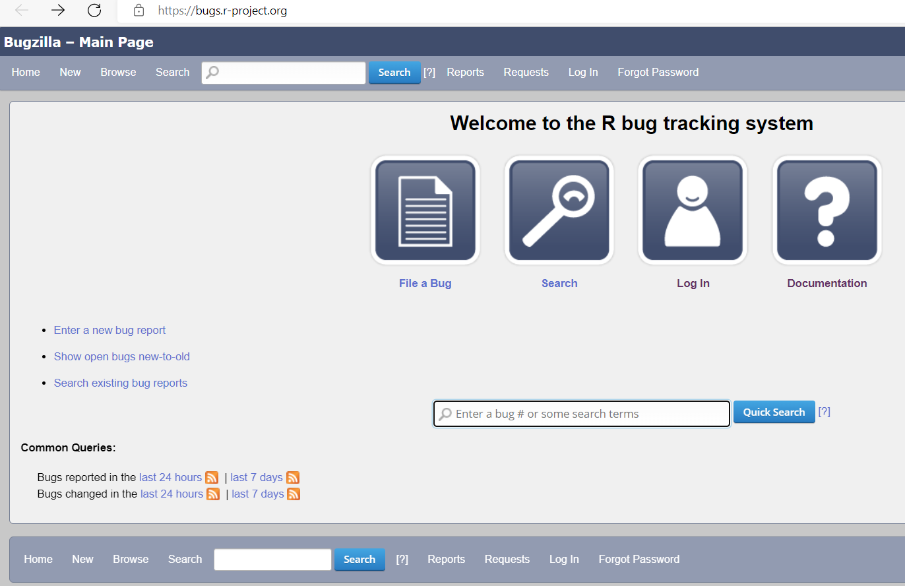

# Reviewing Bugs {#ReviewBugs}

## How you can help to review bug reports?

After understanding where bugs are reported in R (Bugzilla) or in other projects (GitHub/GitLab/R-Forge), a great way to contribute is reviewing bug reports.

Around the clock, new bug reports are being submitted on Bugzilla or the bug trackers (for instance, GitHub issues) of R packages and existing bug reports are being updated. Every bug report needs to be reviewed to make sure various things are in proper order. You can help with this process of reviewing bugs. 

## Navigating Bugzilla {#Bugzilla}

Base R uses [Bugzilla](https://bugs.r-project.org/) for issue tracking. In order to report bugs, as well as fixes, you will first need to create an [account](#RCorePkgBug) on Bugzilla. After having successfully logged in to Bugzilla, you are good to go.

An image of the existing home page of Bugzilla is shared below:

On the home page of Bugzilla, there are various buttons and links. There are four square buttons called as:

1. [File a bug](https://bugs.r-project.org/enter_bug.cgi): You will have to log in to Bugzilla to file a bug using this button

2. [Search](https://bugs.r-project.org/query.cgi): When you click this button you will get a page with 'Simple Search' and 'Advanced Search' options. Either of the search options could be used depending on what you are looking for.

3. [Log In](https://bugs.r-project.org/?GoAheadAndLogIn=1): Provide the appropriate email address and password here to log in to Bugzilla.

4. [Documentation](https://bugzilla.readthedocs.io/en/latest/using/index.html): Provides a user guide for R\'s Bugzilla.

Several useful shortcuts are available from the landing page:

1. [Enter a new bug report](https://bugs.r-project.org/enter_bug.cgi)

2. [Show open bugs new-to-old](https://bugs.r-project.org/buglist.cgi?bug_file_loc_type=allwordssubstr&bug_status=NEW&bug_status=ASSIGNED&bug_status=CONFIRMED&bug_status=REOPENED&bug_status=UNCONFIRMED&bugidtype=include&chfieldto=Now&cmdtype=doit&emailassigned_to1=1&emailassigned_to2=1&emailcc2=1&emailreporter2=1&emailtype1=substring&emailtype2=substring&field0-0-0=noop&long_desc_type=substring&order=bugs.delta_ts%20desc&query_format=advanced&short_desc_type=allwordssubstr&type0-0-0=noop)

3. [Search existing bug reports](https://bugs.r-project.org/query.cgi)

A [quick search](https://bugs.r-project.org/page.cgi?id=quicksearch.html) bar is available on the home page where you can enter a bug number to search or some search terms.

There is also a section for Common Queries on the home page which includes links to bugs reported and changed in the last 24 hours and last 7 days.

### Preparing to review bug reports 

If you want to review bug reports on Bugzilla, you are required to have a Bugzilla account. To get a Bugzilla account send an e-mail to `bug-report-request@r-project.org` from the address you want to use as your Bugzilla login. Briefly explain why you want a Bugzilla account and a volunteer will add you to R's Bugzilla members. More details on how you can review a bug report are available on this [blog](https://developer.r-project.org/Blog/public/2019/10/09/r-can-use-your-help-reviewing-bug-reports/)

## Classifying bug reports

A good bug report is the one which:

1. Explains clearly how to reproduce the bug.

2. Includes the version of R, the machine architecture, and the operating system platform on which the bug occurred.

Relevant details should be a part of a good bug report. You can help with the following tasks once you have some R programming experience:

1. Reproducing the bug: If you see a bug report which does not clearly explain how to reproduce it, you can try reproducing the bug and eventually make things easier for the core developer(s) and/or package maintainer(s).

2. Checking different binary builds: Check whether the bug occurs on a different binary build of R. It is helpful to know whether the bug is affecting: `r-patched`, `r-devel`, or `r-release` binary builds of R.

3. Writing a unit test: If the bug report lacks a unit test that should be a part of R's test suite, then you can help with providing it.

These helpful tasks allow the Core developers and/ or maintainers to classify a bug report properly, so that the bug can be handled in a timely fashion.

## How to find a bug report or an issue to review?

1. You may search old bug reports or issues that could be closed. Old bug reports may no longer be valid or may include a patch that is ready to be committed, but no one has had the time to review and commit.

2. You might also want to search for issues in topics in which you have a working knowledge. When on Bugzilla you can use the advanced search to find specific topics. Bug reports are by default public on Bugzilla (unless the defaults are changed to avoid security vulnerability).

## Example of a bug review submitted on Bugzilla

If you would like to see how bugs are reviewed on Bugzilla, [here](https://bugs.r-project.org/bugzilla/show_bug.cgi?id=16542) is an example where an old bug report is being reviewed. It is tested to see if it was still an issue and a few ways are proposed to resolve the issue.

**Note**:

There is a `#bug-reporting` channel on the [R Contributors slack](https://r-contributors.slack.com/) where you can share your bug report(s) for review/feedback before submitting to Bugzilla. This can help with checking that it really is a bug, that you have included the important information and excluded redundant information.

## See also

1. [Reviewing bug reports: Blog](https://developer.r-project.org/Blog/public/2019/10/09/r-can-use-your-help-reviewing-bug-reports/)
